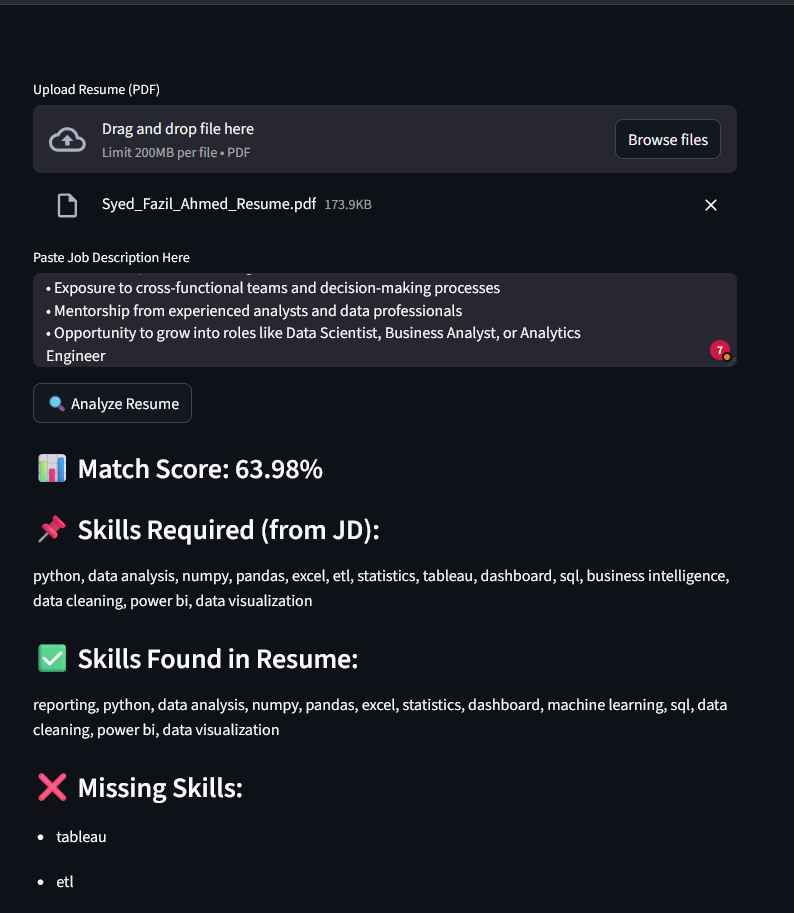

# 📄 AI Resume Analyzer

A Streamlit-based web application that analyzes resumes against job descriptions using semantic similarity and skill matching.

## 🚀 Features

* Upload resume (PDF)
* Paste job description
* Semantic similarity scoring using Sentence Transformers
* Skill extraction and comparison
* Missing skill identification

## 🧠 How It Works

* Converts resume and job description into embeddings
* Uses cosine similarity to measure relevance
* Extracts key skills from both inputs
* Identifies missing skills in the resume

## 🛠️ Tech Stack

* Python
* Streamlit
* Sentence Transformers
* Scikit-learn
* PDFPlumber

## ▶️ Run Locally

```
pip install -r requirements.txt
streamlit run App.py
```

## 📸 Screenshot
 

## ⚠️ Limitations

* Rule-based skill extraction
* Does not measure experience depth

## 🔮 Future Improvements

* Skill importance weighting
* LLM-based suggestions
* Advanced NLP extraction
